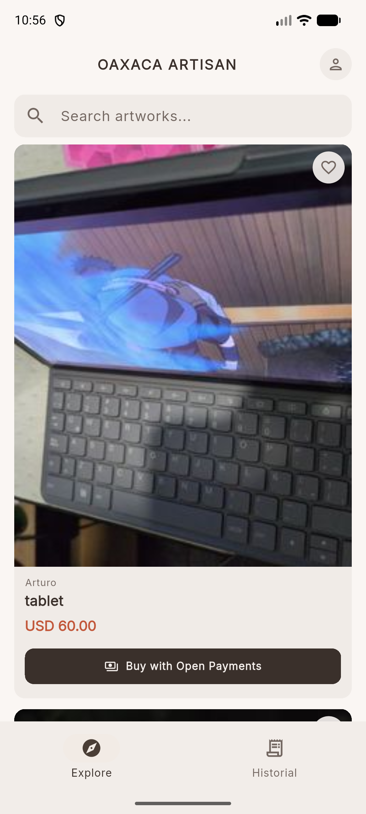
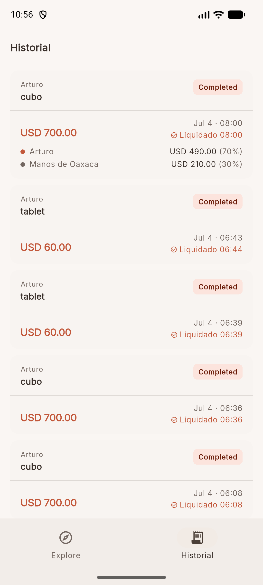
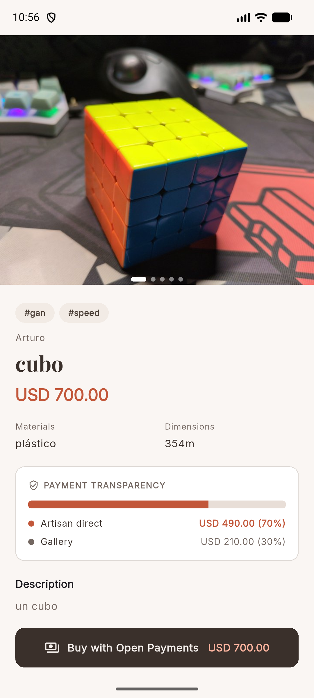
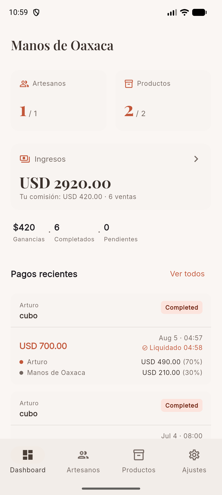
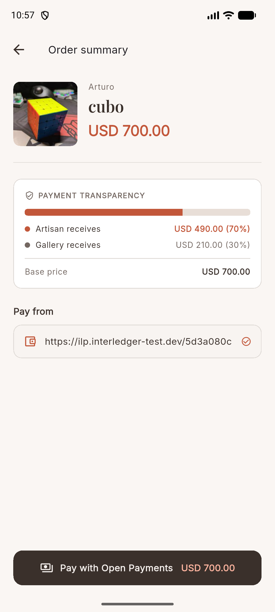
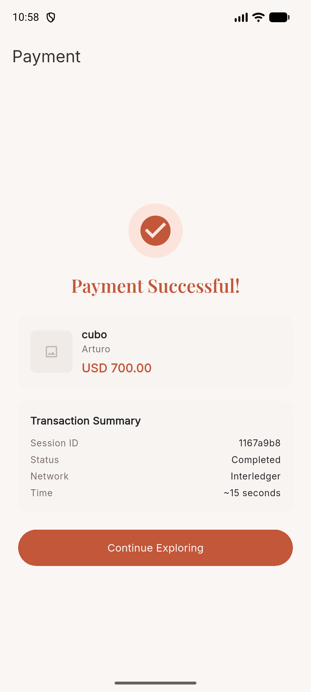
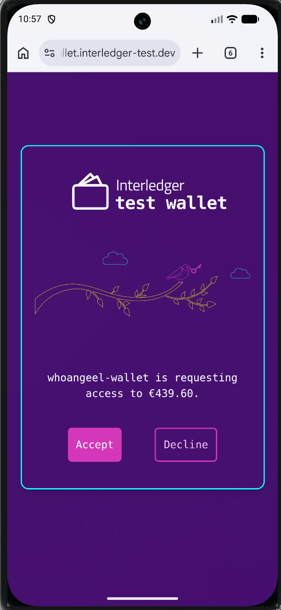
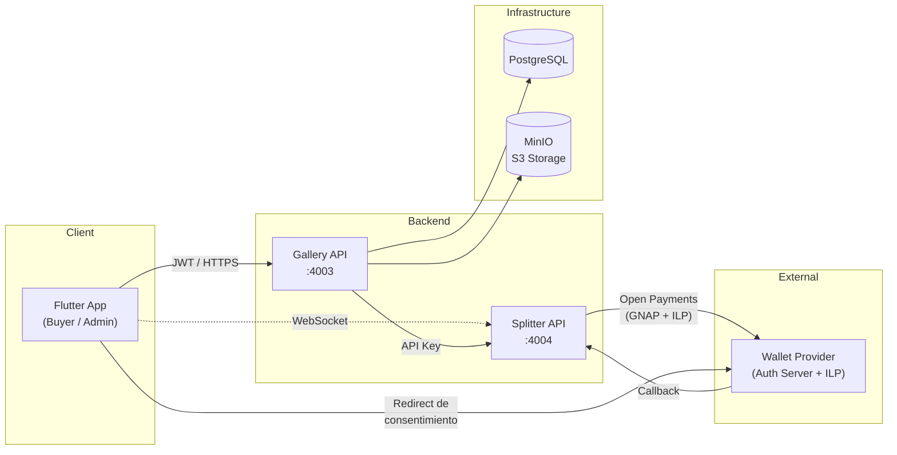
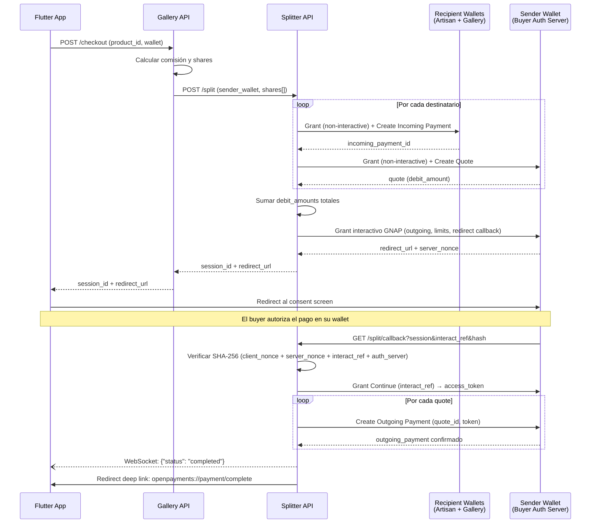

# OpenPayments Splitter


**Plataforma de pagos divididos construida sobre el protocolo [Open Payments](https://openpayments.dev) de Interledger.** El reto técnico central fue integrar Go con Open Payments — un protocolo abierto para pagos programáticos sin intermediarios bancarios — y encapsularlo como un servicio genérico reutilizable (Splitter API).

Como caso de uso real, la plataforma conecta **galerías de arte y artesanos de Oaxaca** con compradores (turistas, extranjeros o cualquier persona) a través de una app móvil. Los compradores exploran productos artesanales y al comprar, el pago se divide automáticamente entre el artesano y la galería según un porcentaje de comisión configurado — con total transparencia. El comprador puede ver exactamente cuánto recibe cada parte, eliminando la opacidad de los intermediarios tradicionales.

**¿Por qué dos servicios?**
- **Splitter API** — Motor genérico de split payments. No conoce artesanos ni galerías; solo recibe wallets y montos. Reutilizable para cualquier escenario de pagos divididos (marketplaces, cooperativas, propinas).
- **Gallery API** — Dominio de negocio. Gestiona galerías, artesanos, productos y comisiones. Calcula los splits y delega la ejecución al Splitter.
- **Flutter App** — Interfaz del comprador. Explorar catálogo, ver transparencia del split, autorizar pagos y recibir confirmación en tiempo real vía WebSocket.

---

## Screenshots

<table>
  <tr>
    <td></td>
    <td></td>
        <td></td>
    <td></td>

  </tr>

  <tr>
    <td></td>
    <td></td>
    <td></td>
    <td></td>
  </tr>
</table>

---

## Arquitectura y Decisiones Técnicas

### Visión General

El sistema sigue una **arquitectura de microservicios** con separación de responsabilidades por bounded context:



| Servicio | Responsabilidad |
|----------|----------------|
| **Gallery API** | Gestión de usuarios, galerías, artesanos, productos, comisiones y favoritos. Calcula los porcentajes del split y delega la ejecución al Splitter. |
| **Splitter API** | Motor de pagos genérico y sin dominio. Orquesta el flujo completo de Open Payments: grants GNAP, incoming payments, quotes y outgoing payments. Notifica al cliente vía WebSocket. |
| **Flutter App** | Aplicación móvil multiplataforma con roles (buyer/admin). Maneja el flujo de checkout con redirect de consentimiento y confirmación en tiempo real. |

### Patrón de Diseño: Layered Architecture por Paquete
### Flujo de Split Payment (Open Payments + GNAP)



### Patrón de Diseño: Layered Architecture por Paquete
Cada servicio en Go sigue una estructura en capas dentro de `internal/`:

```
internal/{servicio}/
├── config/       # Carga de variables de entorno
├── model/        # Entidades de dominio (GORM structs)
├── service/      # Lógica de negocio (unit-testeable)
├── handler/      # Controladores HTTP (Gin handlers)
├── middleware/   # Auth, ownership, logging
└── mailer/       # Adaptadores de envío (Resend, SMTP, Log)
```

Esta separación permite que los **handlers** sean delgados (solo parsing + response), la **lógica de negocio** viva aislada en `service/` con tests unitarios usando SQLite in-memory, y los **modelos** permanezcan agnósticos al framework HTTP.

### Justificación del Stack

| Tecnología | Razón |
|-----------|-------|
| **Go + Gin** | Rendimiento en I/O concurrente, binarios estáticos para contenedores ligeros, ecosistema maduro para APIs HTTP. |
| **PostgreSQL + GORM** | Datos relacionales (usuarios↔galerías↔artesanos↔productos↔comisiones). Integridad referencial crítica para el ciclo de vida de pagos. |
| **MinIO** | Object storage S3-compatible auto-hospedado para imágenes de productos. |
| **Flutter + Riverpod** | UI multiplataforma con gestión de estado reactiva. `AsyncNotifier` simplifica flujos asíncronos complejos (auth, checkout, WebSocket). |
| **WebSocket** | Feedback en tiempo real del estado del pago sin polling. El Splitter notifica al instante cuando el pago se completa en la red Interledger. |
| **Open Payments SDK** | Protocolo abierto de Interledger para pagos programáticos. Evita dependencia en procesadores de pago propietarios. |

### Architecture Decision Records

Las decisiones están documentadas en `docs/adr/`:

- **ADR-0001**: Una sola llave Ed25519 para el Splitter (simplicidad operativa vs complejidad de multi-key sin ganancia de seguridad).
- **ADR-0002**: PostgreSQL sobre Firestore/SQLite (integridad relacional para el ciclo de vida de pagos).
- **ADR-0003**: Gin como framework HTTP (ecosistema, velocidad, experiencia del equipo).
- **ADR-0004**: JWT para App→Gallery, API Key para Gallery→Splitter (stateless mobile-first + service-to-service sin identidad de usuario).

---

## Guía de Despliegue Local

### Prerrequisitos

- Docker y Docker Compose
- Go 1.22+ (para desarrollo sin Docker)
- Flutter SDK 3.9+ (para la app móvil)
- PostgreSQL 16 accesible en el puerto 5433
- MinIO accesible (o cualquier endpoint S3-compatible)
- Una wallet de prueba en [wallet.interledger-test.dev](https://wallet.interledger-test.dev)

### 1. Clonar y configurar variables de entorno

```bash
git clone https://github.com/whoAngeel/openpayments.git
cd openpayments
cp .env.example .env
```

Edita `.env` con tus valores:

```env
# PostgreSQL
DB_PASSWORD=openpayments

# MinIO (object storage para imágenes)
MINIO_ENDPOINT=localhost:9000
MINIO_ACCESS_KEY=minioadmin
MINIO_SECRET_KEY=minioadmin

# Open Payments (obtener en wallet.interledger-test.dev)
WALLET_ADDRESS_URL=https://ilp.interledger-test.dev/tu-wallet
KEY_ID=tu-key-id-uuid
PRIVATE_KEY_PATH=./backend/private.key

# Mail (opcional, para password reset)
RESEND_API_KEY=

# Secrets
JWT_SECRET=un-secreto-seguro
SPLITTER_API_KEY=otra-clave-segura
INVITE_CODE=codigo-de-invitacion

# Splitter public URL (para redirects de callback)
SPLITTER_PUBLIC_URL=http://localhost:4004
```

### 2. Generar la llave Ed25519

```bash
openssl genpkey -algorithm ED25519 -out backend/private.key
```

Registra la llave pública en tu wallet de prueba de Interledger.

### 3. Levantar con Docker Compose

```bash
docker compose up --build
```

Esto inicia:
- **Gallery API** en `http://localhost:4003`
- **Splitter API** en `http://localhost:4004`

La Gallery ejecuta auto-migración de la base de datos al iniciar.

### 4. Desarrollo sin Docker (opcional)

```bash
# Terminal 1: Gallery API
cd backend
go run ./cmd/gallery

# Terminal 2: Splitter API
cd backend
go run ./cmd/splitter
```

### 5. App Flutter

```bash
cd app
flutter pub get
flutter run
```

Configura el endpoint de la Gallery en `app/lib/config/app_config.dart`.

---

## Uso del Sistema

### Endpoints principales — Gallery API (`:4003`)

| Método | Ruta | Descripción | Auth |
|--------|------|-------------|------|
| `POST` | `/api/auth/register` | Registro de usuario | — |
| `POST` | `/api/auth/login` | Login (retorna JWT) | — |
| `POST` | `/api/auth/forgot-password` | Solicitar reset de contraseña | — |
| `GET` | `/api/explore/products` | Catálogo público de productos | — |
| `GET` | `/api/explore/products/:id` | Detalle de producto | — |
| `POST` | `/api/checkout` | Iniciar split payment | JWT |
| `POST` | `/api/checkout/complete` | Confirmar pago completado | JWT |
| `GET` | `/api/payments` | Historial de pagos del buyer | JWT |
| `POST` | `/api/galleries` | Crear galería (admin) | JWT |
| `POST` | `/api/galleries/:id/artisans` | Crear artesano | JWT + Owner |
| `POST` | `/api/galleries/:id/artisans/:id/products` | Crear producto | JWT + Owner |
| `PUT` | `/api/galleries/:id/commission` | Configurar comisión | JWT + Owner |

### Endpoints principales — Splitter API (`:4004`)

| Método | Ruta | Descripción | Auth |
|--------|------|-------------|------|
| `POST` | `/split` | Iniciar flujo de split payment | API Key |
| `GET` | `/split/callback` | Callback de GNAP (redirect del wallet) | — |
| `GET` | `/ws/:session_id` | WebSocket para status del pago | — |
| `GET` | `/wallet` | Info de la wallet configurada | API Key |
| `GET` | `/health` | Health check | — |

### Ejemplo: Flujo de Checkout

```json
// POST /api/checkout
{
  "product_id": 42,
  "wallet_address": "https://ilp.interledger-test.dev/buyer-wallet"
}

// Response 200
{
  "session_id": "a1b2c3d4-...",
  "redirect_url": "https://wallet-provider.com/consent?grant=..."
}
```

El cliente redirige al usuario a `redirect_url`. Tras el consentimiento, el wallet redirige al callback del Splitter, que ejecuta los pagos y notifica vía WebSocket:

```json
// WebSocket message en /ws/{session_id}
{
  "status": "completed",
  "payments": [
    {"recipient": "artisan-wallet", "amount": "8500"},
    {"recipient": "gallery-wallet", "amount": "1500"}
  ]
}
```

---

## Retos Técnicos

### Orquestación del Protocolo GNAP con Split de Pagos Atómico

El principal reto de ingeniería es la **orquestación del flujo de pagos divididos sobre Open Payments**, un protocolo que requiere múltiples llamadas secuenciales y dependientes a diferentes servidores de autorización. Para un solo checkout, el Splitter debe: (1) crear un incoming payment por cada destinatario en su respectivo wallet provider, (2) generar un quote por cada incoming contra el wallet del comprador, (3) sumar todos los debit amounts para solicitar un **grant interactivo GNAP** con redirect de consentimiento, (4) validar el callback mediante hash SHA-256 del nonce, y (5) ejecutar todos los outgoing payments con el token resultante.

Este flujo es inherentemente **stateful y asíncrono**: el estado de la sesión (nonces, quotes, tokens de continuación) se mantiene en memoria con acceso concurrente protegido por `sync.RWMutex`, mientras el usuario interactúa con su wallet en otro dispositivo. La verificación criptográfica del callback (SHA-256 sobre `client_nonce + server_nonce + interact_ref + auth_server_url`) garantiza que solo el authorization server legítimo puede completar la transacción. El WebSocket Hub permite que el frontend reciba confirmación instantánea sin polling, resolviendo el problema de UX inherente a los flujos redirect-based donde el control vuelve al backend, no al cliente.

La separación Gallery/Splitter es deliberada: el Splitter no conoce el concepto de "producto" ni "comisión" — recibe wallets y montos ya calculados. Esto lo hace **reutilizable** para cualquier caso de split payments (marketplaces, cooperativas, propinas distribuidas) sin modificar su código.

---

## Estructura del Proyecto

```
openpayments/
├── backend/                    # Go monorepo
│   ├── cmd/
│   │   ├── gallery/main.go    # Entry point Gallery API (:4000)
│   │   ├── splitter/main.go   # Entry point Splitter API (:4001)
│   │   └── seed/main.go       # Seeder de datos de prueba
│   ├── internal/
│   │   ├── gallery/           # config, handler, service, model, middleware, mailer
│   │   ├── splitter/          # config, handler, service, middleware
│   │   └── shared/            # Modelos compartidos (SplitRequest, pagination)
│   └── go.mod
├── app/                        # Flutter multiplataforma
│   ├── lib/
│   │   ├── config/            # App config, theme
│   │   ├── models/            # DTOs (Product, Artisan, Session, Payment...)
│   │   ├── providers/         # Riverpod AsyncNotifiers (auth, checkout, payments)
│   │   ├── router/            # go_router con ShellRoutes y role-based redirect
│   │   ├── screen/            # Pantallas (explore, checkout, admin, orders)
│   │   ├── service/           # ApiClient, AuthService, WsService, CheckoutService
│   │   └── widgets/           # Componentes reutilizables
│   └── pubspec.yaml
├── docs/
│   ├── adr/                   # Architecture Decision Records
│   └── prd/                   # Product Requirements Documents
├── docker-compose.yml
└── .env.example
```

---

## Testing

```bash
cd backend
go test ./...
```

Los tests de servicios utilizan **SQLite in-memory** como doble de base de datos, validando la lógica de negocio (creación de artesanos, cálculo de comisiones, flujo de autenticación con password reset) sin dependencia de infraestructura externa.
