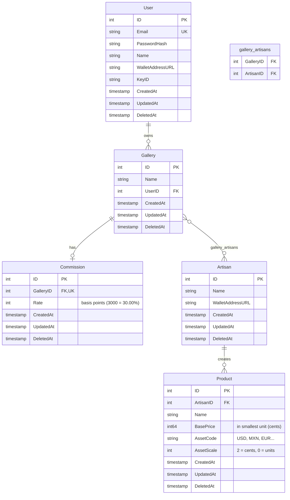

# Database Schema

```mermaid
erDiagram
    User ||--o{ Gallery : owns
    Gallery ||--o| Commission : has
    Gallery }o--o{ Artisan : "gallery_artisans"
    Artisan ||--o{ Product : creates

    User {
        int ID PK
        string Email UK
        string PasswordHash
        string Name
        string WalletAddressURL
        string KeyID
        timestamp CreatedAt
        timestamp UpdatedAt
        timestamp DeletedAt
    }

    Gallery {
        int ID PK
        string Name
        int UserID FK
        timestamp CreatedAt
        timestamp UpdatedAt
        timestamp DeletedAt
    }

    Artisan {
        int ID PK
        string Name
        string WalletAddressURL
        timestamp CreatedAt
        timestamp UpdatedAt
        timestamp DeletedAt
    }

    Product {
        int ID PK
        int ArtisanID FK
        string Name
        int64 BasePrice "in smallest unit (cents)"
        string AssetCode "USD, MXN, EUR..."
        int AssetScale "2 = cents, 0 = units"
        timestamp CreatedAt
        timestamp UpdatedAt
        timestamp DeletedAt
    }

    Commission {
        int ID PK
        int GalleryID FK,UK
        int Rate "basis points (3000 = 30.00%)"
        timestamp CreatedAt
        timestamp UpdatedAt
        timestamp DeletedAt
    }

    gallery_artisans {
        int GalleryID FK
        int ArtisanID FK
    }
```
